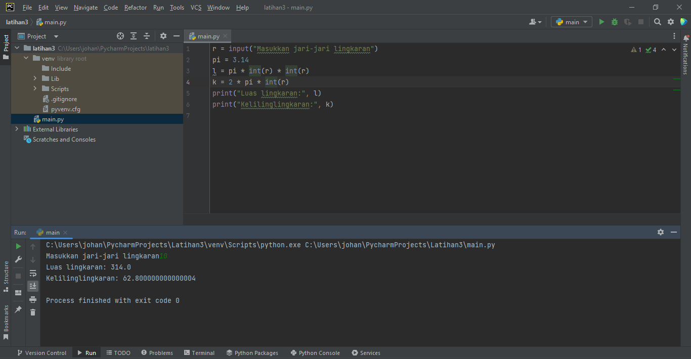

 # Praktikum 3
 ## Latihan 1
 
 ### Penggunaan End
 #### - Penggunaan End pada Python berfungsi untuk memberi parameter (pemisah) antara quotes yang kita buat.
 
 
 
 

### Penggunaan Separator
#### - Penggunaan Separator pada Python berfunsi sebagai pemisah setiap variabel yang telah diberi nilai.

### String Format
#### - String Formatting atau Pemformatan string memungkinkan kita menyuntikkan item ke dalam string daripada kita mencoba menggabungkan string menggunakan koma atau string concatenation.

#### - ini adalah contoh String Concatenation

#### - ini adalah contoh String Formatting

#### - Ada 3 cara untuk melakukan pemformatan string
##### - Metode lama menggunakan placeholder menggunakan karakter '%(modulo)'
##### - Teknik yang diingatkan menggunakan metode string .format()
##### - Metode terbaru, diperkenalkan dengan Python 3.6, menggunakan string literal yang diformat, disebut f-string

## Latihan 2

#### - Tentukan variabel terlebih dahulu, memakai 2 variabel, yaitu a dan b
#### - Beri inputan data variabel
#### - Setelah diberi input, ekspresikan variabel yang telah diberi inputan
#### - Lalu kita mencoba menggabungkan variabel a dan b dengan Formatting String

### Konversi nilai Variabel
